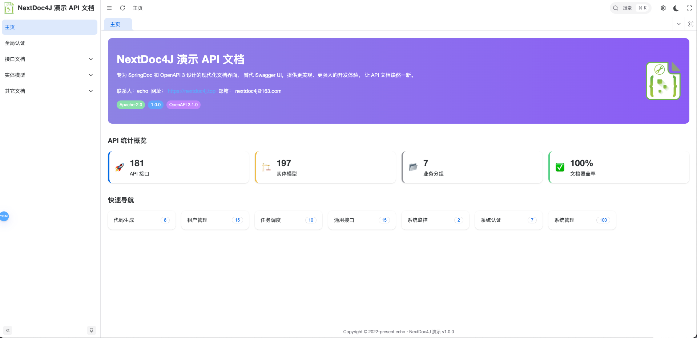
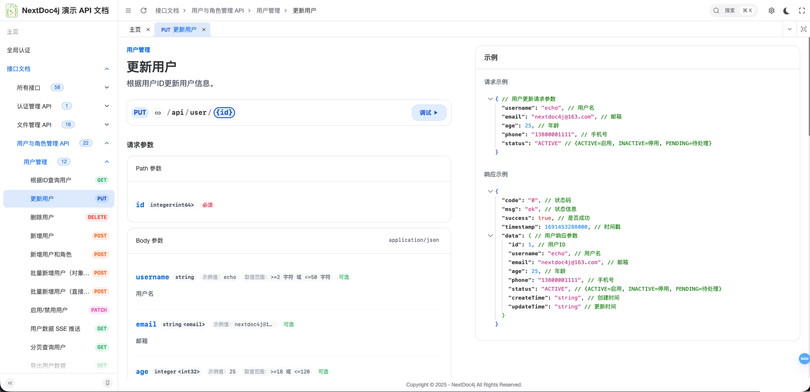

# Nextdoc4j

<div align="center">


**现代化的 API 文档后端解决方案**

基于 SpringBoot 3.4.x + SpringDoc 构建，完美替代 Swagger UI 的后端支撑

[在线演示](https://demo.nextdoc4j.top/) | [文档](https://nextdoc4j.top/)

</div>

## 📖 项目简介

Nextdoc4j 是一款现代化的 API 文档后端解决方案，专为 **SpringDoc** 和 **OpenAPI 3** 设计。它深度适配 SpringDoc 生态系统，在保留 API 文档核心功能的基础上，提供更强的安全性、灵活的配置能力以及优化的交互体验，完美替代传统的 Swagger UI。

NextDoc4j 帮助开发团队提高 API 文档的管理和调试效率，使文档系统成为研发流程中的得力助手。

### ✨ 核心特性

- 🎨 **现代化界面** - 与前端深度整合，提供比 Swagger UI 更优雅的体验
- 🔒 **安全认证** - 内置简单登录校验，保护接口文档安全
- 🛠️ **灵活配置** - 支持功能开关、生产模式等多维度配置
- 🚀 **深度适配** - 专为 SpringDoc 和 OpenAPI 3 优化
- 🎯 **品牌定制** - 支持自定义 logo、标题等品牌元素

## 🖼️ 界面预览

### 主界面


*直观的API文档首页，集成项目概览、业务分组和快速定位功能*

### 文档详情界面

*接口详情页面，集成在线调试工具，支持参数输入、响应预览和JSON数据结构化展示*

### 登录界面


*支持动态 title 和 logo 渲染，可配置化自定义*

## 🚀 快速开始

### 环境要求

- **Java**: >= 17
- **SpringBoot**: >= 3.4.x
- **SpringDoc**: 与 OpenAPI 3 兼容

### 安装使用

#### 1. 引入依赖

在 `pom.xml` 中添加以下依赖：

```xml
<dependency>
    <groupId>top.nextdoc4j</groupId>
    <artifactId>nextdoc4j-springboot3-starter</artifactId>
    <version>1.0.0</version>
</dependency>
```


#### 2. 基础配置

在 `application.yml` 或 `application.properties` 中添加配置：

**application.yml：**
```yaml
nextdoc4j:
  enabled: true  # 是否启用 NextDoc4j，默认 false
```

**application.properties：**
```properties
nextdoc4j.enabled=true
```

#### 3. 访问文档

启动应用后，访问 `http://localhost:端口/doc.html` 即可使用 nextdoc4j 文档系统。

## 🔧 技术栈

- **核心框架**: SpringBoot 3.4.x
- **文档规范**: SpringDoc + OpenAPI 3
- **构建工具**: Maven
- **JDK版本**: Java 17+

## 🤝 贡献指南

我们欢迎所有形式的贡献！参与方式：

### 问题反馈

- 在 [Issues](https://gitee.com/nextdoc4j/nextdoc4j/issues) 中反馈 Bug
- 提供清晰的复现步骤和环境信息
- 建议优先搜索已有问题，避免重复

### 功能建议

- 通过 Issue 提交功能需求
- 详细描述使用场景和预期效果
- 欢迎讨论实现方案

### 代码贡献

1. Fork 本仓库
2. 创建功能分支: `git checkout -b feature/awesome-feature`
3. 提交更改: `git commit -m 'feat: add awesome feature'`
4. 推送分支: `git push origin feature/awesome-feature`
5. 创建 Pull Request

### 提交规范

遵循 [Conventional Commits](https://conventionalcommits.org/) 规范：

- `feat`: 新功能
- `fix`: 修复问题
- `docs`: 文档更新
- `style`: 代码格式调整
- `refactor`: 代码重构
- `test`: 测试相关
- `chore`: 构建/工具链相关

## 📄 许可证

本项目基于 [Apache-2.0 License](LICENSE) 开源协议，详见项目根目录的 `LICENSE` 文件。

## 🙏 致谢

- [SpringDoc](https://springdoc.org/) - 优秀的 OpenAPI 3 集成框架
- [Spring Boot](https://spring.io/projects/spring-boot) - 强大的 Java 应用框架
- [OpenAPI](https://swagger.io/specification/) - API 文档标准规范

## 📧 联系方式

- **官方文档**: [https://dockit4j.top](https://nextdoc4j.top/)
- **问题反馈**: [https://gitee.com/nextdoc4j/nextdoc4j/issues](https://gitee.com/nextdoc4j/nextdoc4j/issues)
- **联系邮箱**: nextdoc4j@163.com

---

<div align="center">

如果这个项目对你有帮助，请给它一个 ⭐️

