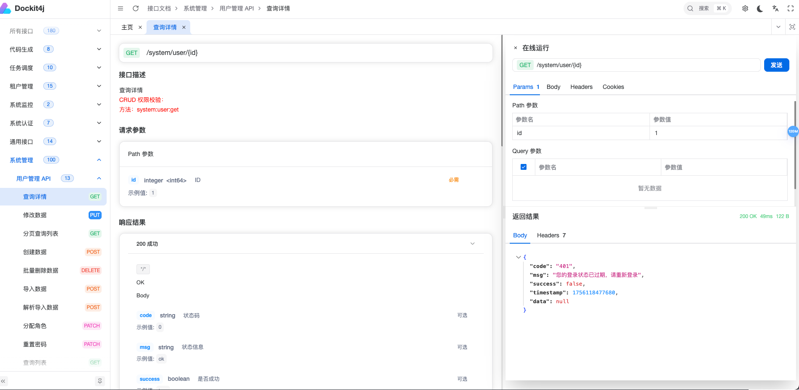
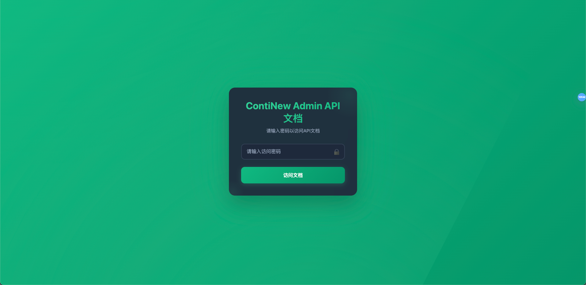

## 项目信息
| 属性                | 值                                                                 |
| ------------------- | ------------------------------------------------------------------ |
| 版本                | v1.0.0                                                            |
| 支持框架            | SpringDoc, OpenAPI 3, SpringBoot 3.4.x                            |
| 替代工具            | Swagger UI                                                         |
| 开源协议            | Apache License 2.0                                                |
| 官方文档            | [https://docs.dockit4j.top](https://docs.dockit4j.top)           |
| 联系邮箱            | dockit4j@126.com                                                  |
| 前端仓库            | [https://gitee.com/dockit4j/dockit4j-ui](https://gitee.com/dockit4j/dockit4j-ui) |
| 后端仓库            | [https://gitee.com/dockit4j/dockit4j](https://gitee.com/dockit4j/dockit4j) |
| 文档仓库            | [https://gitee.com/dockit4j/dockit4j-docs](https://gitee.com/dockit4j/dockit4j-docs) |

## 项目简介
dockit4j 是一款现代化的文档 UI 工具，专为 **SpringDoc** 和 **OpenAPI 3** 设计，旨在替代传统的 Swagger UI。它提供更美观的界面、更强的定制能力以及更流畅的交互体验。

dockit4j 深度适配 SpringDoc 生态系统，在保留 API 文档核心功能的基础上，优化了界面交互、功能扩展和实用性体验，帮助开发团队提高 API 文档的管理和调试效率，使文档系统成为研发流程中的得力助手。



## 主要功能
### 1. 全新 UI 体系
- 界面层级清晰，参数与响应示例排版符合阅读习惯，信息获取更便捷
- 优化交互逻辑，如调试按钮触发、文档折叠展开等操作，符合开发日常使用场景

### 2. 灵活配置能力
- **功能开关**：按需启用或禁用功能（如文档启用、生产启用等）
- **生产模式**：适配生产环境，优化文档访问权限，保障系统稳定
- **配置简单**：兼容 Spring 的配置方式，可通过配置文件或代码快速调整行为

### 3. 安全与品牌定制
- **认证登录**：新增登录校验，可对接项目权限体系，保障文档访问安全
- **品牌植入**：支持自定义品牌 logo、系统标题，融入团队或项目风格

### 4. 动态界面优化
- **登录界面**：实现动态 title 和 logo 渲染，支持配置化自定义内容
- **主页同步**：与登录页风格统一，动态加载标题和 logo，保持视觉一致性
- **性能优化**：动态效果基于轻量化渲染，不影响加载速度和交互流畅度



## 快速开始
### 1. 引入依赖
在 `pom.xml` 中添加以下依赖：
```xml
<dependency>
    <groupId>zw.dockit4j</groupId>
    <artifactId>dockit4j-springboot3-starter</artifactId>
    <version>${Latest version}</version>
</dependency>
```

### 2. 配置参数
在 `application.yml` 中配置以下内容：
```yaml
dockit4j:
  enabled: true # 启用 dockit4j，默认 false
```

### 3. 访问文档
启动应用后，访问 `http://localhost:端口/doc.html` 即可使用 dockit4j 文档系统。

## 贡献指南
欢迎通过以下方式参与 dockit4j 的开发：
- 提交 **Issue**：反馈功能建议或 Bug，提供清晰的复现步骤或需求描述
- 发起 **Pull Request**：提交代码优化或新功能，建议先通过 Issue 沟通方案

## 开源协议
dockit4j 采用 [Apache-2.0] 协议开源，详见仓库中的 `LICENSE` 文件。

## 支持与交流
- 官方文档：[https://docs.dockit4j.top](https://docs.dockit4j.top)
- 问题反馈：[https://gitee.com/dockit4j/dockit4j/issues](https://gitee.com/dockit4j/dockit4j/issues)
- 联系邮箱：dockit4j@126.com