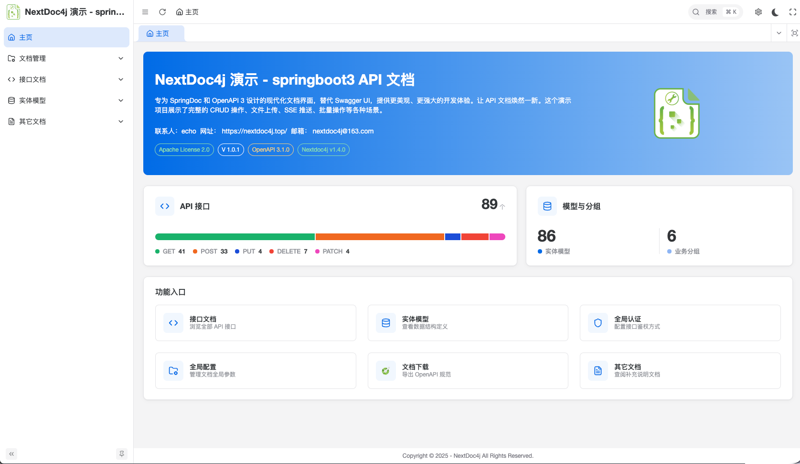
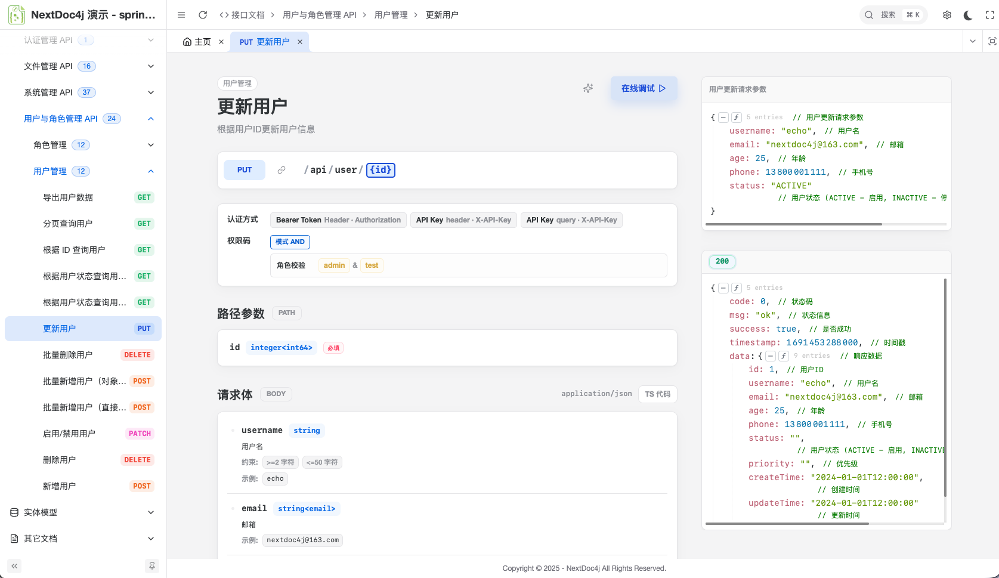
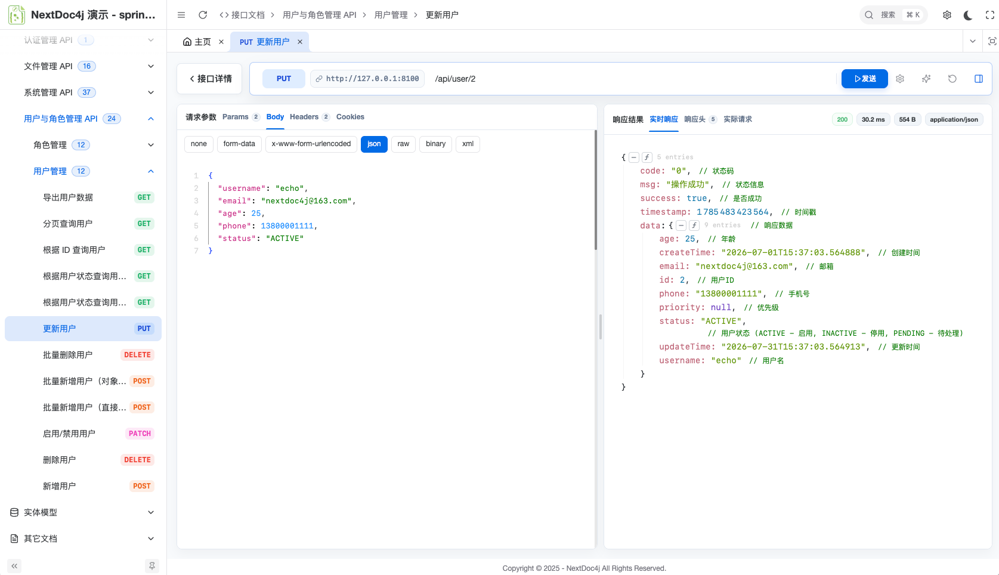
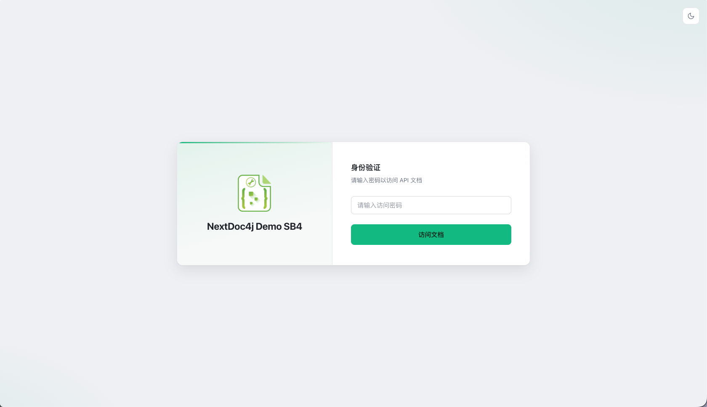

<p align="center">
  
</p>

<h1 align="center">Nextdoc4j</h1>

<p align="center">
  <strong>🚀 现代化的 API 文档后端解决方案</strong><br>
  基于 <strong>SpringBoot 3.4.x</strong> + <strong>SpringDoc</strong> 构建，替代 Swagger UI，<br>
  提供更美观、更强大的开发体验，让 API 文档焕然一新。
</p>

<p align="center">
  🌐 <a href="https://demo.nextdoc4j.top/">在线演示</a> |
  📘 <a href="https://nextdoc4j.top/">官方文档</a> |
  🧩 <a href="https://nextdoc4j.top/more/changelog.html">更新日志</a> |
  ❓ <a href="https://nextdoc4j.top/more/faq.html">常见问题</a>
</p>


## 📦 代码仓库

| 平台      | 仓库地址                                                                               |
|---------|------------------------------------------------------------------------------------|
| GitCode | [https://gitcode.com/NextDoc4j/nextdoc4j](https://gitcode.com/NextDoc4j/nextdoc4j) |
| Gitee   | [https://gitee.com/nextdoc4j/nextdoc4j](https://gitee.com/nextdoc4j/nextdoc4j)     |
| GitHub  | [https://github.com/NextDoc4j/nextdoc4j](https://github.com/NextDoc4j/nextdoc4j)   |


## 📖 项目简介

Nextdoc4j 是一款现代化的 API 文档后端解决方案，专为 **SpringDoc** 和 **OpenAPI 3** 设计。它深度适配 SpringDoc 生态系统，在保留 API 文档核心功能的基础上，提供更强的安全性、灵活的配置能力以及优化的交互体验，完美替代传统的 Swagger UI。

NextDoc4j 帮助开发团队提高 API 文档的管理和调试效率，使文档系统成为研发流程中的得力助手。

### ✨ 核心特性

- 🎨 **现代化界面** - 与前端深度整合，提供比 Swagger UI 更优雅的体验
- 🔒 **安全认证** - 内置简单登录校验，保护接口文档安全
- 🛠️ **灵活配置** - 支持功能开关、生产模式等多维度配置
- 🚀 **深度适配** - 专为 SpringDoc 和 OpenAPI 3 优化
- 🎯 **品牌定制** - 支持自定义 logo、标题等品牌元素

## 🖼️ 界面预览

### 主界面


*直观的API文档首页，集成项目概览、业务分组和快速定位功能*

### 文档详情界面


*接口详情页面，集成在线调试工具，支持参数输入、响应预览和JSON数据结构化展示*


*接口在线调试页面，支持请求方法选择、参数输入、请求头编辑、实时响应预览及 JSON 结构化展示，可直接发起 API 调用并查看返回数据详情*

### 登录界面


*支持动态 title 和 logo 渲染，可配置化自定义*

## 🚀 快速开始

### 环境要求

- **Java**: >= 17
- **Spring Boot**: 3.5.x 或 4.x
- **SpringDoc**: 与 OpenAPI 3 兼容（WebMVC / WebFlux UI 由宿主引入）

### 安装使用

#### 1. 引入依赖

在 `pom.xml` 中添加以下依赖：
```xml
<!-- 一个 dependencyManagement：先平台栈，再 NextDoc4j（仅对齐 top.nextdoc4j 自身模块） -->
<dependencyManagement>
    <dependencies>
        <!-- 已有 spring-boot-starter-parent 时可省略 Boot BOM -->
        <dependency>
            <groupId>org.springframework.boot</groupId>
            <artifactId>spring-boot-dependencies</artifactId>
            <version>3.5.16</version><!-- Boot 4 请改用 4.x -->
            <type>pom</type>
            <scope>import</scope>
        </dependency>
        <!-- springdoc 不在 Boot BOM 内：Boot 3 用 2.x，Boot 4 用 3.x -->
        <dependency>
            <groupId>org.springdoc</groupId>
            <artifactId>springdoc-openapi-bom</artifactId>
            <version>2.8.17</version>
            <type>pom</type>
            <scope>import</scope>
        </dependency>
        <dependency>
            <groupId>top.nextdoc4j</groupId>
            <artifactId>nextdoc4j-bom</artifactId>
            <version>{latest-version}</version>
            <type>pom</type>
            <scope>import</scope>
        </dependency>
    </dependencies>
</dependencyManagement>

<!-- 单体：统一坐标（Boot 3 / Boot 4 共用）；版本可由上方 nextdoc4j-bom 管理 -->
<dependency>
    <groupId>top.nextdoc4j</groupId>
    <artifactId>nextdoc4j-spring-boot-starter</artifactId>
</dependency>
<!-- 宿主引入匹配的 springdoc UI（版本由 springdoc BOM 管理） -->
<dependency>
    <groupId>org.springdoc</groupId>
    <artifactId>springdoc-openapi-starter-webmvc-ui</artifactId>
    <!-- WebFlux 单体请改用 springdoc-openapi-starter-webflux-ui -->
</dependency>
```

网关场景使用 `nextdoc4j-gateway-spring-boot-starter`（命名对齐 Spring Cloud 风格），并自行引入对应的 Spring Cloud Gateway（`spring-cloud-starter-gateway-server-webflux` 或 `spring-cloud-starter-gateway-server-webmvc`）与 springdoc UI。

#### 2. 基础配置

在 `application.yml` 或 `application.properties` 中添加配置：

**application.yml:**
```yaml
nextdoc4j:
  enabled: true  # 是否启用 NextDoc4j，默认 false
```

**application.properties:**
```properties
nextdoc4j.enabled=true
```

#### 3. 访问文档

启动应用后，访问 `http://localhost:端口/doc.html` 即可使用 nextdoc4j 文档系统。

更多配置和使用方式请参考 [官方文档](https://nextdoc4j.top/)。

## 🔧 技术栈

- **核心框架**: Spring Boot 3.5.x / Spring Boot 4.x
- **文档规范**: SpringDoc + OpenAPI 3（版本由宿主管理）
- **构建工具**: Maven
- **JDK版本**: Java 17+

## 🤝 参与贡献

我们欢迎所有形式的贡献！包括但不限于：

- 🐛 提交 Bug 反馈
- 💡 提供功能建议
- 📝 改进文档
- 💻 贡献代码

详细的贡献指南请访问：[贡献指南](https://nextdoc4j.top/more/contribute.html)

## 📚 相关链接

- **官方文档**: [https://nextdoc4j.top](https://nextdoc4j.top)
- **贡献指南**: [https://nextdoc4j.top/more/contribute.html](https://nextdoc4j.top/more/contribute.html)
- **更新日志**: [https://nextdoc4j.top/more/changelog.html](https://nextdoc4j.top/more/changelog.html)
- **常见问题**: [https://nextdoc4j.top/more/faq.html](https://nextdoc4j.top/more/faq.html)
- **团队介绍**: [https://nextdoc4j.top/more/team/team.html](https://nextdoc4j.top/more/team/team.html)

## 📄 许可证

本项目基于 [Apache-2.0 License](LICENSE) 开源协议，详见项目根目录的 `LICENSE` 文件。

## 🙏 致谢

- [SpringDoc](https://springdoc.org/) - 优秀的 OpenAPI 3 集成框架
- [Spring Boot](https://spring.io/projects/spring-boot) - 强大的 Java 应用框架
- [OpenAPI](https://swagger.io/specification/) - API 文档标准规范

## 🌐 社区

本项目已在 [LINUX DO](https://linux.do) 社区发布，欢迎加入讨论。

---

**NextDoc4j** - 让 API 文档焕然一新！  如果这个项目对你有帮助，请给它一个 ⭐️